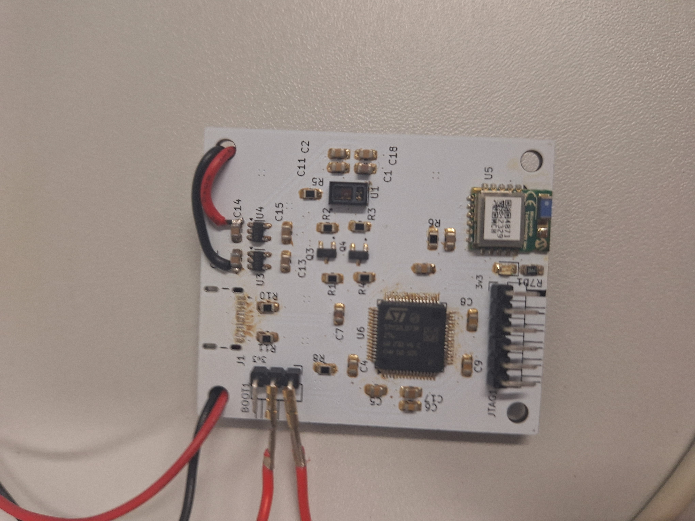
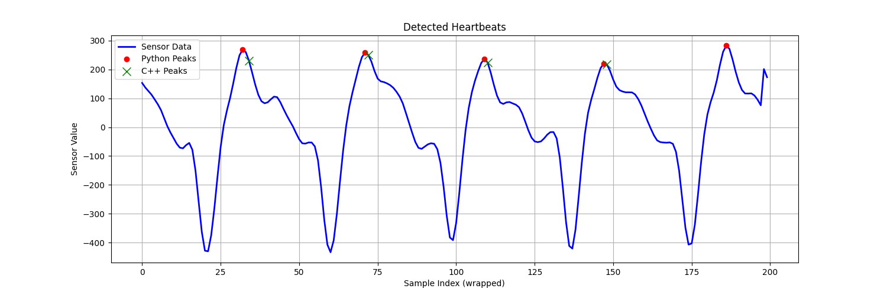
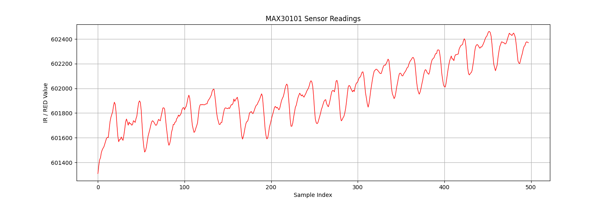
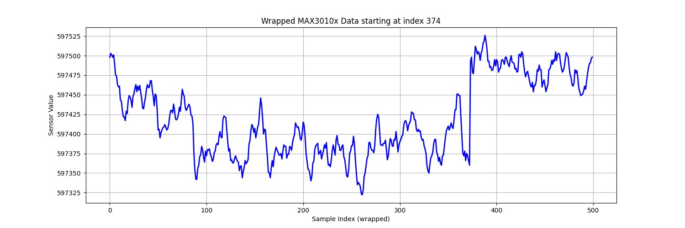

# PulsOximeter

> **Group course project.** This was developed as part of a university course together with a project partner. I was responsible for the majority of the **hardware design**, and did **100% of the firmware and filter/signal processing**. My project partner contributed smaller parts of the hardware design (given that he was new to hardware design) and developed the **Android app**.

## Overview
This project implements a complete pulse oximeter system, combining:
- Custom hardware design  
- Embedded firmware development  
- Signal processing (filtering and peak detection)  
- A simple Android app connected via Bluetooth Low Energy (BLE)  

The system measures pulse and oxygen saturation and displays the results in real time on a mobile device.

---

## Hardware
Custom-designed and built PCB with integrated pulse/oximeter sensor.

  

---

## Signal Processing
The main emphasis of this project is robust pulse detection from noisy sensor data.
- Bandpass filter designed for 0.8 – 3.5 Hz  
- Covers typical human heart rate range (1.0 – 3.3 Hz) with margin  
- Reduces noise and motion artifacts  
- Enables reliable peak detection for pulse extraction  

Filtered and processed signal:

> **Filter robustness:** the bandpass filter reliably extracts the pulse waveform whether the raw sensor input is already clean or heavily corrupted by noise.
>
> | Clean Input | High-Noise Input |
> |:---:|:---:|
> |  |  |
>
> At first, only a highpass filter was applied to compensate for low-frequency drift. After further testing with higher-noise readings, this was extended to the full bandpass approach shown above.
>
> Note: these plots are sampled from a ring buffer with a non-compensated offset, so the high-noise(~ index 380) and filtered image (~ index 190) show a visible cut/discontinuity where the last reading wraps around to the first.

---

## System Demonstration

### Pulse Measurement on Hardware
Shows real-time pulse detection directly from the device. Recording of messurment run as displayed in "Signal Processing".

[Watch the demo](./Documentation/IMG/Demo_PulseSensorApp.mp4)

---

### App Visualization
Android app displaying measured pulse and oxygen saturation via BLE.

---
## Summary
This project demonstrates a complete embedded system with a strong focus on signal processing. The combination of tailored filtering and peak detection enables accurate pulse measurement from noisy sensor data, integrated into a fully functional hardware and software solution.
